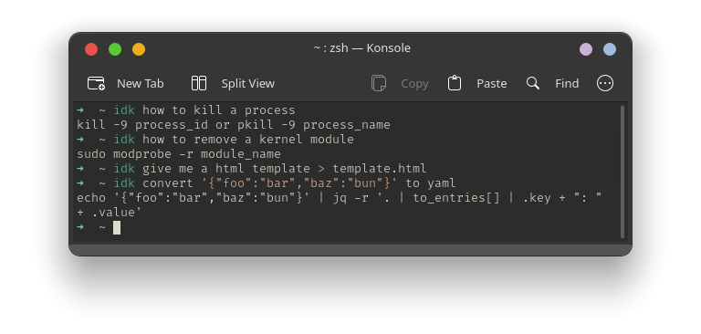

# IDK CLI Tool

IDK is a command-line tool that provides concise, professional Linux commands based on user queries. It integrates with the Groq API to interpret user instructions and returns a suitable command without unnecessary formatting. IDK also stores previously used queries and responses for quick reference.

## Features

- **Linux Command Generator**: Enter a query, and IDK returns an accurate Linux command.
- **Caching**: Saves previous queries and responses in a local SQLite database to optimize responses for recurring queries.
- **Clipboard Integration**: Copies the command output directly to the clipboard for easy pasting.
- **Customizable**: You are the limit.

## Installation 

### For Nix Users

```bash
git clone <repository-url>
cd <repository-directory>
nix-build
# Binary will be available at ./result/bin/idk
```

### For Nix Users (2)

```nix
let
  idkPackage = import (builtins.fetchGit {
    url = "<repository-url>";
    ref = "main";
    rev = "<commit-sha>";
  });
in

{
  environment.systemPackages = with pkgs; [
    idkPackage
  ];
}

```

Set the environment variable for the API key:

```bash
export IDK_GROQ_API_KEY=<your-api-key>
```


## Usage

Run the tool with a query for the Linux command:

```bash
idk how to list all files in a directory
```

The result will display the command and copy it to your clipboard for convenience.



## Dependencies

This project uses:
- **Python Packages**: `requests` for API requests.
- **External Tools**: `xclip` for clipboard integration.
- **Groq API**: Requires an API key to access the Groq API.

## Contributing

Feel free to open issues or pull requests for feature suggestions, bug fixes, or optimizations.

## License

This project is licensed under the MIT License.

--- 